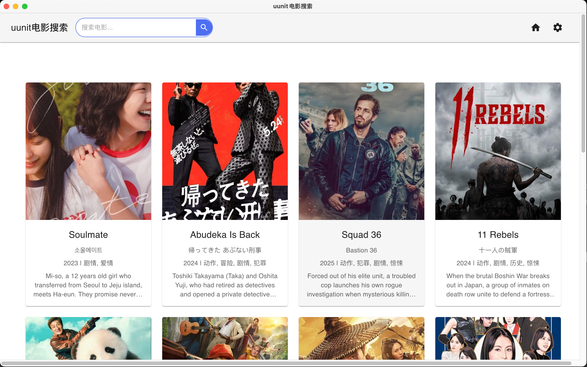

# uunit - Movie Resource Manager

[中文文档](README_CN.md)

## Introduction

uunit is a cross-platform desktop application developed with Electron and React for managing and organizing magnet resources. It integrates an intelligent crawler system and automatic movie information matching functionality, providing users with a powerful resource management solution.

## screenshot



## Main Features

### 1. Intelligent Crawler System

- Support for multi-source site crawling
- Automatic extraction and saving of magnet links
- Intelligent link deduplication and status management
- Proxy settings support for stable access

### 2. Resource Management

- Unified management and storage of magnet links
- Support for automatic resource title parsing
- Resource search and filtering functionality

### 3. Movie Information Matching

- Automatic matching with TMDB movie data
- Display detailed movie information (covers, synopsis, etc.)
- Support for local movie database search

## Installation and Running

1. Clone the project and install dependencies:

```bash
npm install
```

2. Run in development mode:

```bash
npm run dev
```

3. Build the application:

```bash
npm run electron:build
```

## Project Structure

- `/electron` - Electron main process code
- `/src` - React renderer process code
- `/public` - Static resource files

## Development Team

- Author: William Wong

## License

This project is licensed under the MIT License.
