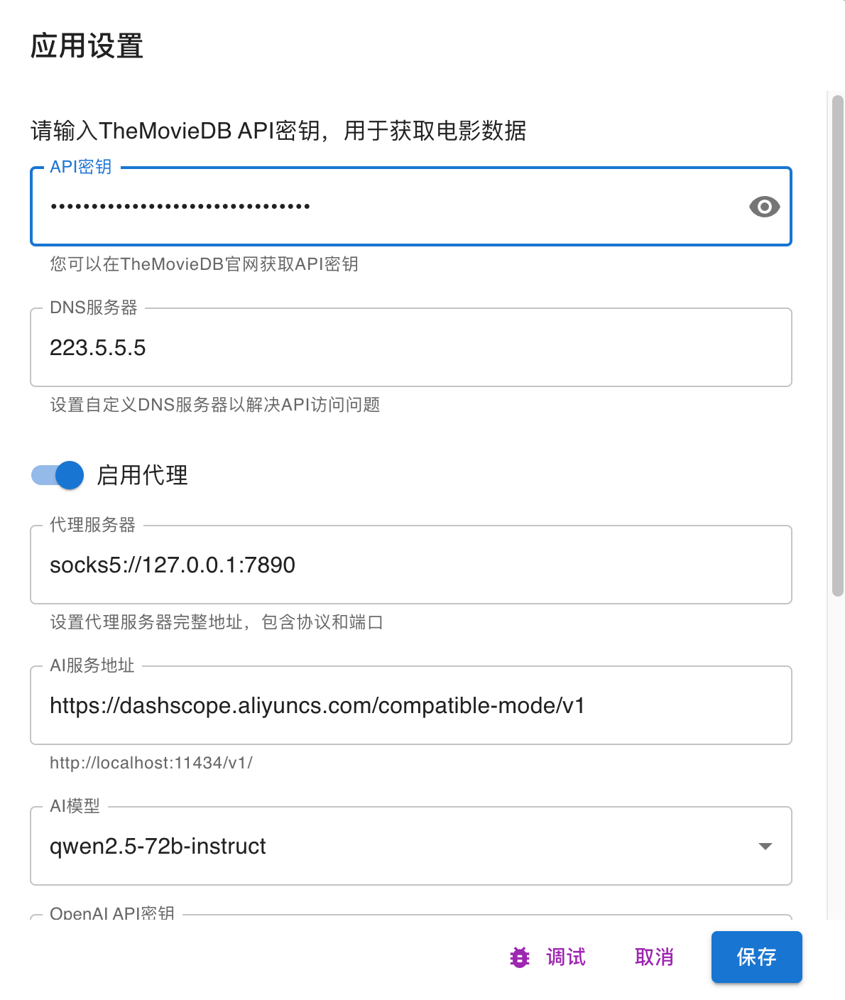

# uunit - 磁力电影小工具

## 简介

uunit 是一个基于 Electron 和 React 开发的跨平台桌面应用程序，用于管理和组织磁力资源。它集成了智能爬虫系统和电影信息自动匹配功能，为用户提供了一个强大的资源管理解决方案。

## 运行截图


## 主要功能

### 1. 智能爬虫系统

- 支持多源站点爬取
- 自动提取和保存磁力链接
- 智能链接去重和状态管理
- 支持代理设置，确保访问稳定性

### 2. 资源管理

- 磁力链接的统一管理和存储
- 支持资源标题自动解析
- 提供资源搜索和过滤功能

### 3. 电影信息匹配

- 自动匹配 TMDB 电影数据
- 展示电影详细信息（封面、简介等）
- 支持本地电影数据库搜索

### 4. 推荐设置



## 开发指南

1. 克隆项目并安装依赖：

```bash
npm install
```

2. 开发模式运行：

```bash
npm run dev
```

3. 构建应用：

```bash
npm run electron:build
```

## 项目结构

- `/electron` - Electron 主进程代码
- `/src` - React 渲染进程代码
- `/public` - 静态资源文件

## 开发团队

- 作者：William Wong

## 许可证

本项目采用 MIT 许可证。
